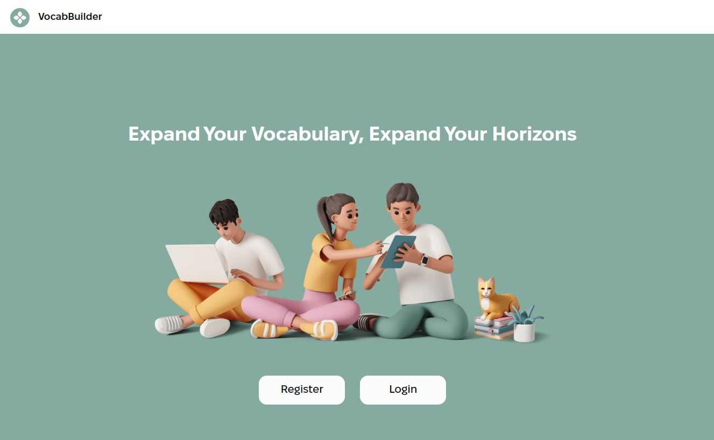
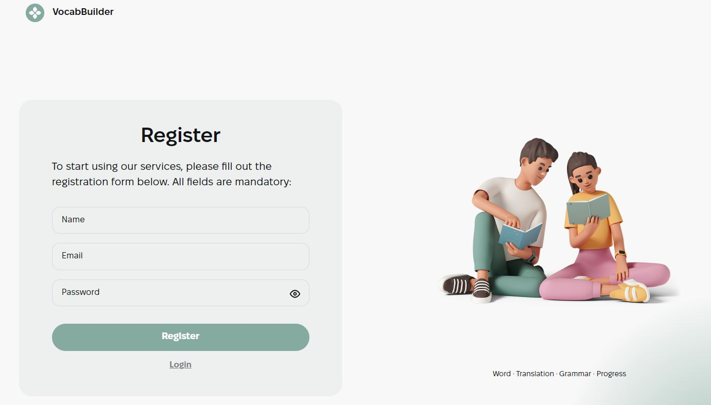
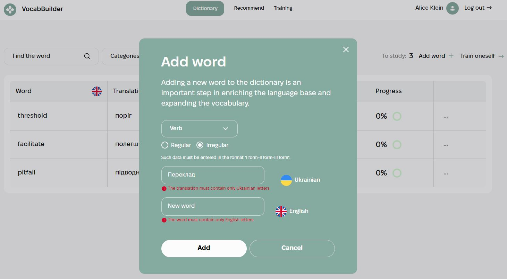
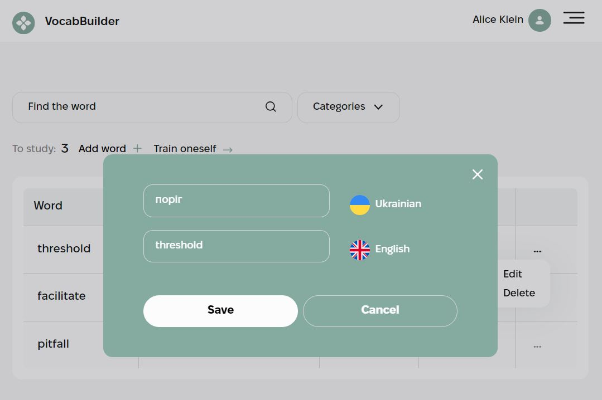
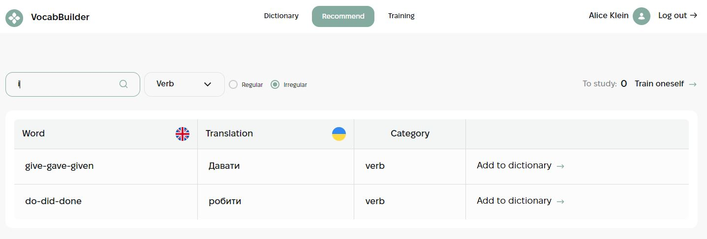
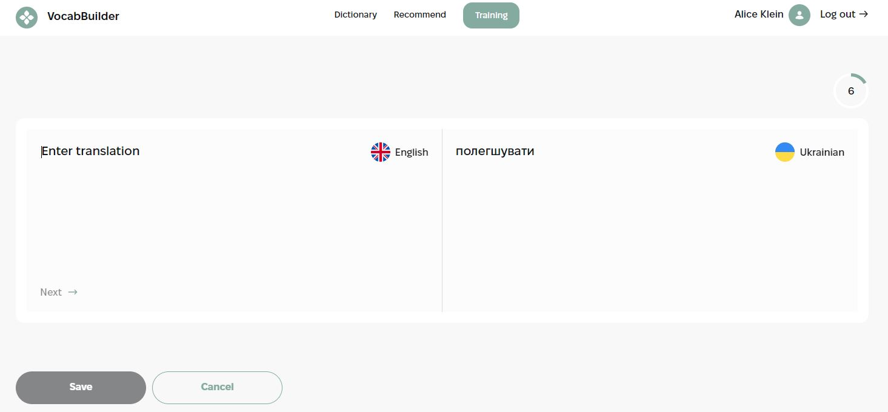
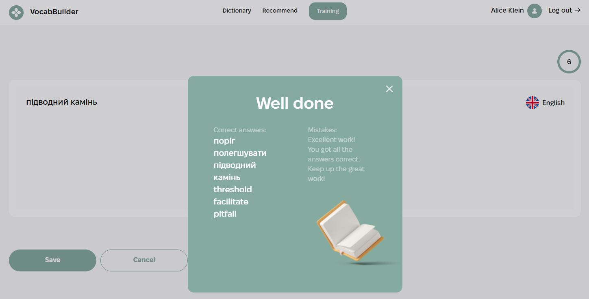
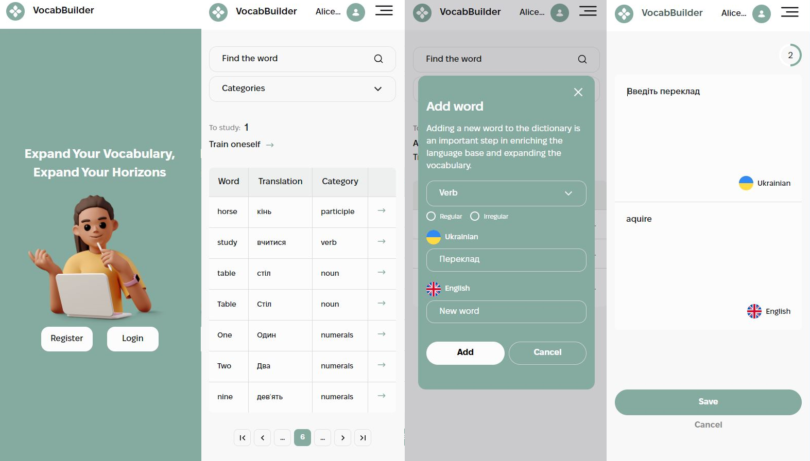

# VocabBuilder

VocabBuilder is a vocabulary-building application designed for Ukrainians learning English. The app is developed using TypeScript and React, styled with CSS modules, and utilizes Redux Toolkit for state management. Users can manage their vocabulary, track their progress, and train themselves through interactive exercises.

## Used technologies

## Features

- User Authentication: Users must be authorized to access the app's features.
  

- Vocabulary Management: Users can add, edit, and delete their own words.
  

  

- Recommended Words: Users can add recommended words from other users to their collections.
  

- Progress Tracking: Users can monitor their progress and see statistics about their learning journey.

- Filtering: Users can filter words by keywords and categories.

- Training Room: An interactive training room where users practice translations and receive feedback. Words that users struggle with are retained for further training.
  

  

- Responsive Design: The app is styled to be fully responsive, ensuring a seamless user experience across different devices and screen sizes.
  

## Contact

For questions or support, contact me at `https://github.com/AliceBondMe`
